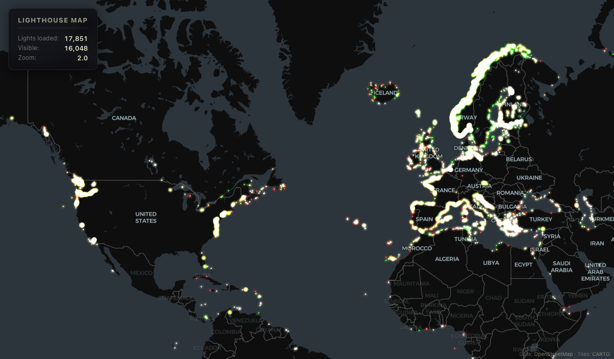

# Lighthouse Map

Interactive map of every lighthouse in the world with accurate light flash animations.

Each light is rendered with its real characteristic pattern (flashing, occulting, isophase, morse, etc.), correct color, and appropriate range -- all drawn as glowing beams on a dark canvas overlay.



## Run

```bash
npx serve . -p 8080
```

Then open http://localhost:8080.

## Data

~17,851 lights loaded from `data/lighthouses-full.json`. The app accepts:

- A flat JSON array of lighthouse objects
- GeoJSON FeatureCollection (from geodienst or similar)
- Overpass API JSON response

Source: [OpenStreetMap](https://www.openstreetmap.org/) seamark data via [geodienst](https://geodienst.xyz/).

## Tech Stack

- **MapLibre GL JS** 4.7.1 -- vector tile map rendering
- **CARTO Dark Matter** -- base map tiles (no API key needed)
- **Canvas 2D** -- light beam and glow rendering with additive blending
- Vanilla JavaScript, no build step

## Level of Detail

| Zoom   | Rendering                              |
|--------|----------------------------------------|
| < 6    | Glowing dots with color                |
| 6 - 10 | Larger animated dots with flash patterns |
| > 10   | Full rotating light beams              |

## Features

- 17,851 lights with correct colors (white, red, green, yellow)
- 10 flash pattern types faithfully reproduced
- Rotating beams with proportional nautical mile ranges
- Hover tooltips with name, light characteristic, range, height
- English labels globally
- India boundary per Survey of India guidelines
- Zero API keys required

## License

MIT
